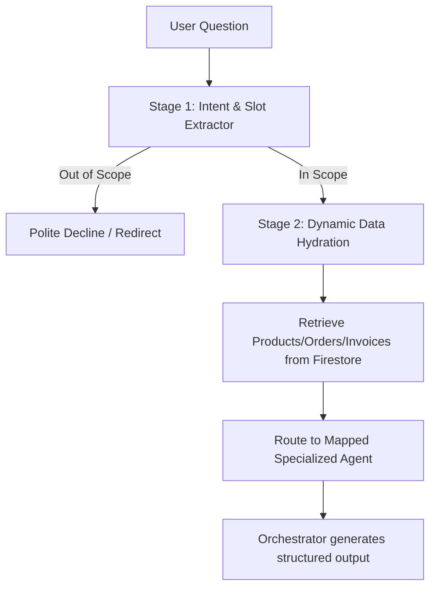

# AI Insights - Intent Classification & Agent Mapping

This document describes how the rebuilt two-stage AI reasoning pipeline classifies user queries and routes them to specialized agents within the `marketplace.store` Multi-Agent Orchestrator.

---

## The Two-Stage Reasoning Pipeline

### Stage 1: Intent & Slot Extraction
When a merchant asks a question in the AI Insights chat, the query is first sent to Gemini (or parsed via a local fallback) to determine:
1. **Scope validation**: Is the query within the 5 allowed domains?
2. **Intent classification**: Which domain categories does the query target?
3. **Slot extraction**: What parameters (e.g. `dateRange`, `product`, `sku`, `competitor`, `channel`) are specified or needed? If a timeframe is omitted, a sensible default (e.g. `last 30 days`) is chosen.

If a query is out of scope (e.g. coding, recipe, weather), the pipeline short-circuits here and returns a polite decline redirecting the user back to the allowed business domains.

### Stage 2: Context-Aware Answer Generation
If the query is in-scope, the backend performs the following steps:
1. **Dynamic Data Fetching**: Queries Firestore for the merchant's live profile, product catalog, B2B orders, buyer inquiries, and invoices.
2. **Dynamic Context Assembly**: Builds a token-efficient summary of the retrieved records, and explicitly appends detailed specifications for any product matched by the extracted slots.
3. **Agent Routing**: Maps the classified intents to the corresponding specialized agents:

| Classified Intent / Category | Mapped Agent Name | Target Agent Domain |
| :--- | :--- | :--- |
| **`business_insights`** | `Analytics Agent` | `analytics` |
| **`business_analysis`** | `Analytics Agent` | `analytics` |
| **`news`** | `Market Intelligence Agent` | `market_intel` |
| **`market_research`** | `Market Intelligence Agent` | `market_intel` |
| **`marketing_seo`** | `Marketing Agent` | `marketing` |

4. **Multi-Agent Orchestration**: Invokes the `orchestrate` function which uses the specialized agent instructions (e.g. professional SEO/ad copy formats for Marketing Agent, or safety stock buffer calculations for Analytics Agent) to reason over the hydrated business data and construct the final structured JSON response.
