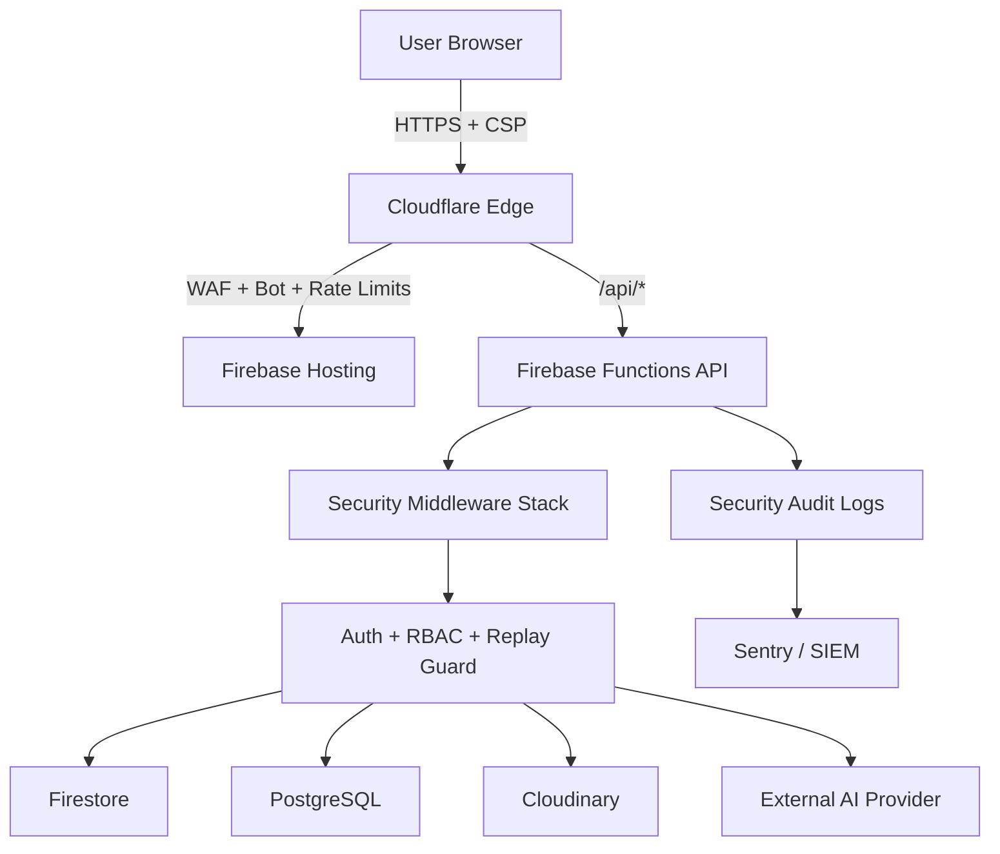

# Security Architecture

## Secure by default principles
- Zero trust between browser, API, data stores, and third-party providers.
- Least privilege access at every layer.
- Deny-by-default request validation and authorization checks.
- Privacy-first logging with PII redaction.

## High-level architecture

## API middleware chain
1. `helmet` + strict headers
2. Request ID assignment (`X-Request-ID`)
3. Origin and CSRF validation for state-changing requests
4. Replay guard (`X-Timestamp`, `X-Nonce`, drift <= 5 min)
5. Input sanitization (NoSQL operators, prototype pollution, oversized strings)
6. Endpoint-specific rate limits
7. AuthN/AuthZ and ownership checks
8. Structured audit logs with secret redaction

## Data trust boundaries
- Browser is untrusted.
- API validates all payloads and rejects unknown fields.
- Firestore/PostgreSQL are reachable only through backend service accounts.
- Secrets are loaded at runtime from secure env/secret manager.

## Session architecture
- Access token TTL: 15 minutes.
- Refresh token rotation in `authRefreshTokens` collection.
- Replay-safe JWT claims include `jti` + nonce.
- Refresh token revocation on rotation and expiry.

## Privacy-by-design controls
- PII redaction in request audit logs.
- No credential/token logging.
- Minimal retention recommendations in operations runbook.
- Data export and account deletion hooks must remain enabled.
